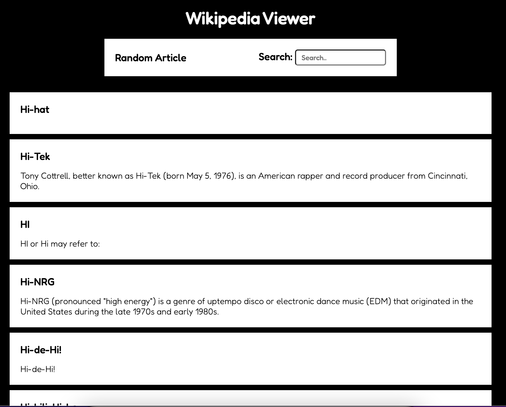

# Wikipedia Viewer

This is a solution to the [Build a Wikipedia Viewer](https://www.freecodecamp.org/learn/coding-interview-prep/take-home-projects/build-a-wikipedia-viewer) from [FreeCodeCamp](https://www.freecodecamp.org/). FreeCodeCamp is a non-profit organization that consists of an interactive learning web platform, an online community forum, chat rooms, online publications and local organizations that intend to make learning web development accessible to anyone. 

## Table of contents

- [Overview](#overview)
  - [The challenge](#the-challenge)
  - [Screenshot](#screenshot)
  - [Links](#links)
- [My process](#my-process)
  - [Built with](#built-with)
- [Author](#author)

## Overview

### The challenge

Users should be able to:

- View the optimal layout for the site depending on their device's screen size
- See hover states for all interactive elements on the page
- Search Wikipedia entries in a search box
- See the resulting wikipedia entries
- See a random Wikipedia entry

### Screenshot

### Links

- Solution URL: [https://github.com/Krrish105/wikipedia-viewer](https://github.com/wikipedia-viewer)
- Live Site URL: [https://krrish105.github.io/wikipedia-viewer/](https://krrish105.github.io/wikipedia-viewer/)

## My process

### Built with

- Semantic HTML5 markup
- CSS custom properties
- Flexbox
- CSS Grid
- Mobile-first workflow
- JQuery
- [Wikipedia API](https://www.mediawiki.org/wiki/API:Main_page)

## Author

- Frontend Mentor - [Krrish105](https://www.frontendmentor.io/profile/Krrish105)
- Twitter - [_karishma10](https://twitter.com/_karishma10)
- LinkedIn - [Karishma Garg](https://www.linkedin.com/in/karishma-garg-)
- Codepen - [Krrish105](https://codepen.io/krrish105)